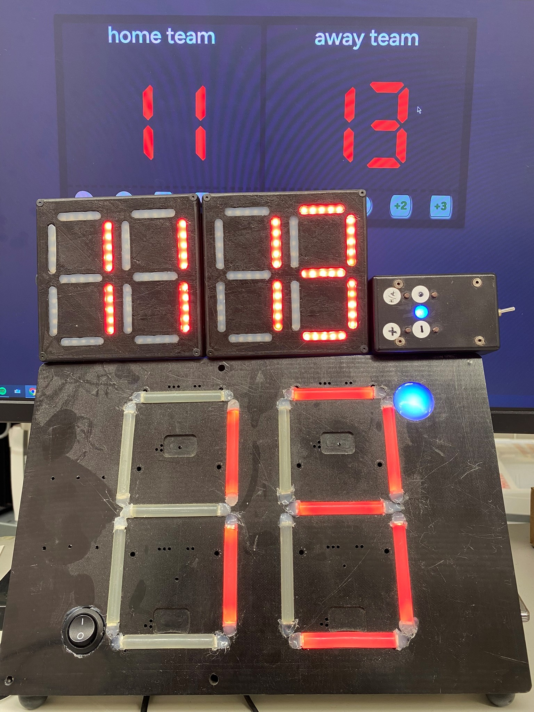
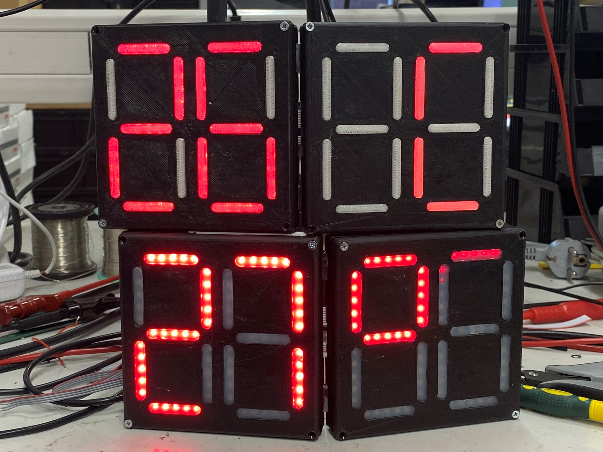

<p align="center"><a href="https://gametime.ee" target="_blank"></a></p>

<p align="center">
    <a href="https://github.com/avrokj/gametime/actions"></a>
</p>

## Lühidalt GameTime-st / GameTime Overview

GameTime on taskutabloo veebirakendus, kus saab hallata oma meeskonda, luua uusi mänge ja üritusi, muuta mängu tulemust ja vaadata statistikat juba toimunud mängude kohta. Taskutabloo küsib andmebaasist infot, mida kuvada kindla ajavahemiku järel, et tagada teabe ajakohasus.

Kastajaliides on ehitatud Laravel Blade baasil.

Kujundamiseks võtsime kasutusele Tailwind CSSi stiiliraamistiku, mis võimaldab kiiresti luua kujundusi. Selle peamine erinevus teistest raamistikest on see, et ta keskendub madalale tasemele pakkudes mitmesuguseid klassinimesid, mis võimaldavad kiiresti luua kohandatud kujundusi ilma CSSi käsitsi kirjutamata.

Lisaks kasutame DaisyUI/MaryUI komponentide kogu, mis on ehitatud Tailwind CSSi peale. See pakub suure hulga eelnevalt kujundatud komponente, mis võimaldab arendajatel kiirendada oma veebirakenduste arendamist, hoides samal ajal koodi puhta ja loetavana.

Kasutame ka Vanilla JavaScripti ehk puhast JavaScripti.

#

GameTime is a pocket scoreboard web application where you can manage your team, create new games and events, change game results, and view statistics for past games. The pocket scoreboard fetches information from the database at regular intervals to ensure data accuracy.

The user interface is built on the Laravel Blade framework.

For design, we have adopted the Tailwind CSS framework, which allows for rapid design creation. Its main difference from other frameworks is that it focuses on low-level utility, offering various class names that enable quick creation of custom designs without manually writing CSS.

Additionally, we use the DaisyUI/MaryUI component library, which is built on top of Tailwind CSS. It provides a large set of pre-designed components, allowing developers to speed up the development of their web applications while keeping the code clean and readable.

We also use Vanilla JavaScript, i.e., pure JavaScript.

## Lingid / Links

-   **[Taskutabloo GitHub BT_Scoreboard - ](https://github.com/avrokj/BT_Scoreboard)**
-   **[Test - test.gametime.ee](https://test.gametime.ee/)**
-   **[Webpage - gametime.ee](https://gametime.ee/)**

## Pildid / Pictures


_Uus ja vana tabloo / New and old scoreboard_


_Taskutabloo prototüübid / Pocket scoreboard prototypes_

## Paigaldamine / Installation

Clone the repository to your local machine:

```console
git clone <repository-url>
```

Navigate to the project directory:

```console
cd gametime
```

Install Composer dependencies:

```console
composer install
```

Install NPM dependencies:

```console
npm install
```

Copy the .env.example file to .env and configure your environment variables:

```console
cp .env.example .env
```

Generate an application key:

```console
php artisan key:generate
```

Run database migrations and seeders:

```console
php artisan migrate --seed
```

Start the development server:

```console
php artisan serve
```

Compile your project's assets:

```console
npm run dev

```

Visit [http://localhost:8000](http://localhost:8000) in your web browser to view the application.

## Usage

The application allows users to make teams, add players, create games and make a schedule with statistics of each game.

## License

The Laravel framework is open-sourced software licensed under the [MIT license](https://opensource.org/licenses/MIT).
